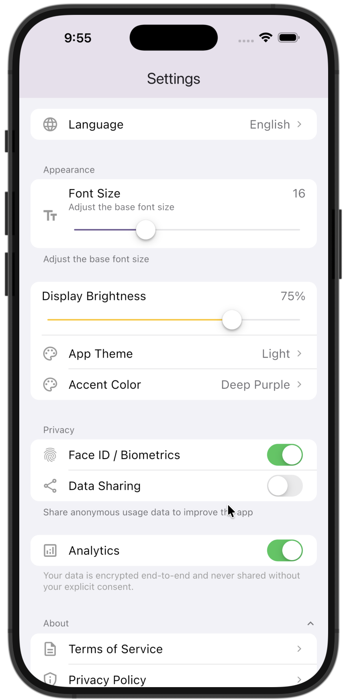
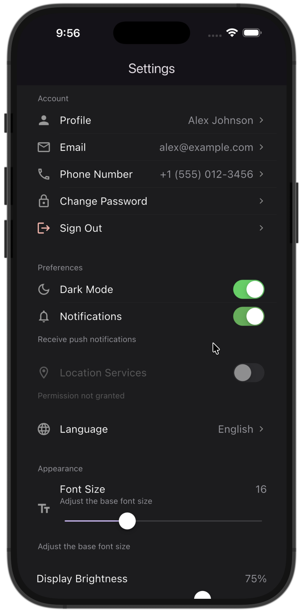
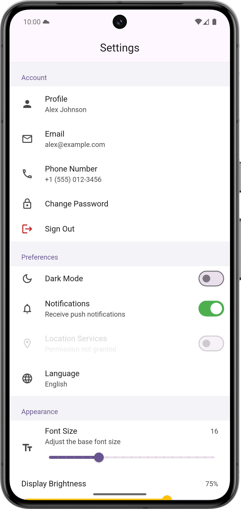
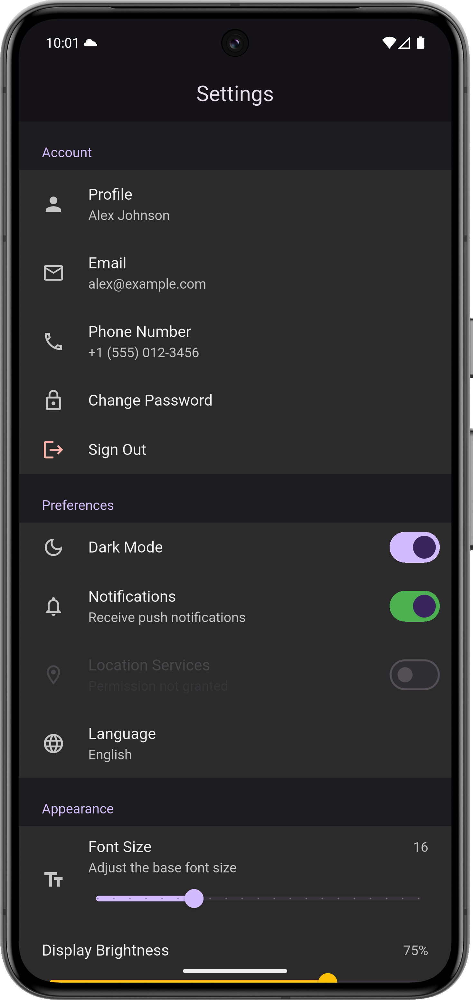
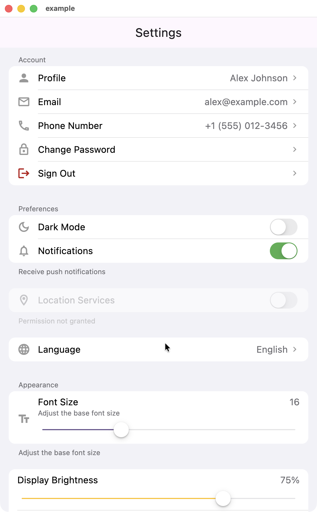
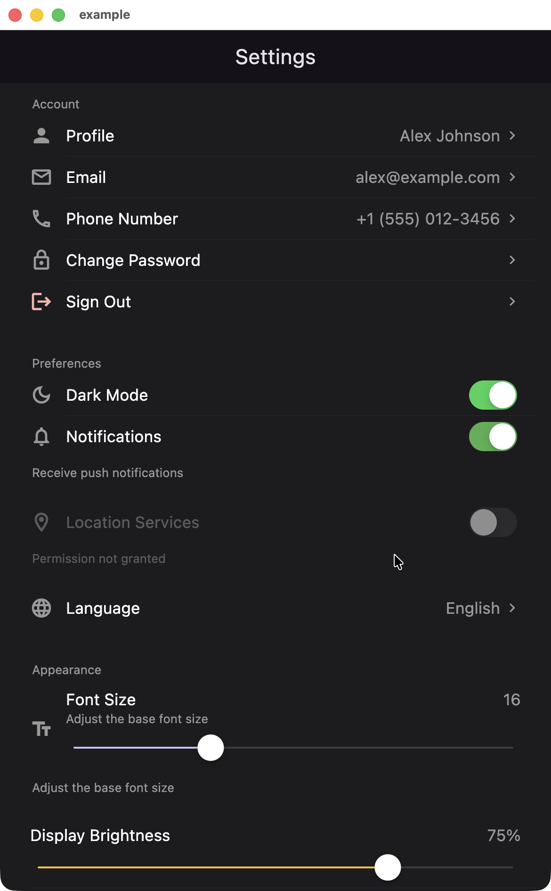
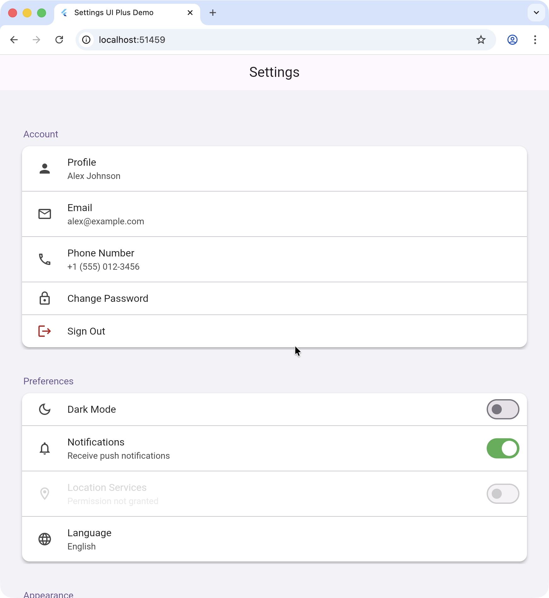
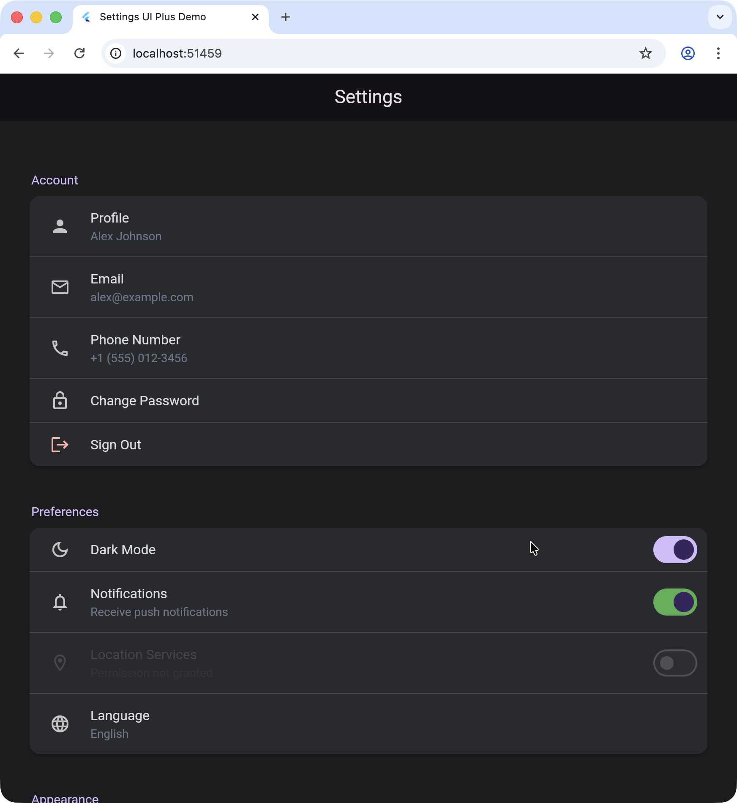

# settings_ui_plus

[](https://pub.dev/packages/settings_ui_plus)
[](https://github.com/faizahmaddae/settings-ui-plus/actions/workflows/ci.yml)
[](https://pub.dev/packages/settings_ui_plus/score)
[](LICENSE)

Build native-looking settings screens in Flutter with minimal effort. Automatically adapts to **Material** and **Cupertino** design guidelines. A maintained, modernized fork of [`settings_ui`](https://github.com/yako-dev/flutter-settings-ui).

---

## Preview

| iPhone (Light) | iPhone (Dark) | Android (Light) | Android (Dark) |
|---|---|---|---|
|  |  |  |  |

| macOS (Light) | macOS (Dark) | Web (Light) | Web (Dark) |
|---|---|---|---|
|  |  |  |  |

---

## Features

- Platform-adaptive UI (Material + Cupertino)
- Navigation, switch, slider, radio, and **dropdown** tiles
- **Searchable settings** — `SearchableSettingsList` with real-time filtering
- **Sliver support** — `SliverSettingsList` for `CustomScrollView` integration
- Expandable & collapsible sections
- Section headers and footers
- Custom tiles and custom sections
- **Per-tile theming** via `SettingsTileThemeData`
- **Animated value transitions** — smooth cross-fade on tile value changes
- **`fromColorScheme` factory** — generate a full theme from Material 3 `ColorScheme`
- Disabled tile support
- Long-press callbacks on all tiles
- Light/dark theme overrides via `SettingsThemeData`
- Accessible (semantics, 44pt touch targets, reduced-motion support)
- RTL and desktop ready

---

## Installation

```yaml
dependencies:
  settings_ui_plus: ^0.2.7
```

```dart
import 'package:settings_ui_plus/settings_ui_plus.dart';
```

---

## Quick Example

```dart
SettingsList(
  sections: [
    SettingsSection(
      title: const Text('Preferences'),
      tiles: [
        SettingsTile.switchTile(
          title: const Text('Dark Mode'),
          leading: const Icon(Icons.dark_mode),
          initialValue: false,
          onToggle: (value) {},
        ),
        SettingsTile.navigation(
          title: const Text('Language'),
          leading: const Icon(Icons.language),
          value: const Text('English'),
          onPressed: (context) {},
        ),
        SettingsTile.sliderTile(
          title: const Text('Font Size'),
          leading: const Icon(Icons.text_fields),
          sliderValue: 16,
          sliderMin: 10,
          sliderMax: 30,
          value: const Text('16'),
          onSliderChanged: (value) {},
        ),
      ],
    ),
    SettingsSection(
      title: const Text('About'),
      expandable: true,
      initiallyExpanded: false,
      footer: const Text('Your data is stored securely.'),
      tiles: [
        SettingsTile.navigation(
          title: const Text('Privacy Policy'),
          leading: const Icon(Icons.privacy_tip_outlined),
        ),
      ],
    ),
  ],
)
```

---

## More Examples

### Dropdown Tile

```dart
SettingsTile.dropdownTile(
  title: const Text('Language'),
  leading: const Icon(Icons.language),
  dropdownValue: 'English',
  dropdownItems: const ['English', 'Spanish', 'French', 'German'],
  onDropdownChanged: (value) {},
)
```

### Searchable Settings

```dart
SearchableSettingsList(
  sections: [
    SettingsSection(
      title: const Text('General'),
      tiles: [
        SettingsTile.navigation(
          title: const Text('Language'),
          value: const Text('English'),
        ),
      ],
    ),
  ],
)
```

### Sliver Settings (inside CustomScrollView)

```dart
CustomScrollView(
  slivers: [
    const SliverAppBar(title: Text('Settings')),
    SliverSettingsList(
      sections: [
        SettingsSection(
          title: const Text('Account'),
          tiles: [
            SettingsTile.navigation(
              title: const Text('Email'),
              value: const Text('user@example.com'),
            ),
          ],
        ),
      ],
    ),
  ],
)
```

### Per-Tile Theme Override

```dart
SettingsTile.navigation(
  title: const Text('Premium Feature'),
  leading: const Icon(Icons.star),
  tileTheme: SettingsTileThemeData(
    tileBackgroundColor: Colors.amber.shade50,
    titleTextColor: Colors.amber.shade900,
  ),
)
```

### Theme from ColorScheme

```dart
SettingsList(
  lightTheme: SettingsThemeData.fromColorScheme(ColorScheme.light()),
  darkTheme: SettingsThemeData.fromColorScheme(ColorScheme.dark()),
  sections: [ ... ],
)
```

---

## Example App

A full example app with every feature — dropdown tiles, searchable settings, sliver integration, per-tile theming, and more:

**[example/lib/main.dart](example/lib/main.dart)**

---

## Why settings_ui_plus?

The original [`settings_ui`](https://github.com/yako-dev/flutter-settings-ui) package has been inactive since 2023. This fork fixes bugs, adds features, and stays up to date with Flutter.

| | `settings_ui` | `settings_ui_plus` |
|---|---|---|
| Maintained | Inactive | Active |
| Flutter 3.x / Material 3 | Partial | Full |
| Slider tiles | — | Built-in |
| Radio tiles | — | Built-in |
| Dropdown tiles | — | Built-in |
| Expandable sections | — | Built-in |
| Searchable settings | — | Built-in |
| Sliver support | — | Built-in |
| Section footers | — | Built-in |
| Long-press callbacks | — | All tiles |
| Custom sections | — | Built-in |
| Per-tile theming | — | `SettingsTileThemeData` |
| Animated value changes | — | Built-in |
| Theming | Limited | 14+ properties, light + dark, `fromColorScheme` |
| Accessibility | Basic | Semantics, touch targets, reduced-motion |
| Desktop | Minimal | Hover, focus, pointer cursor |

---

## License

Apache 2.0 — inherited from the original [`settings_ui`](https://github.com/yako-dev/flutter-settings-ui) package. See [LICENSE](LICENSE) for details.
